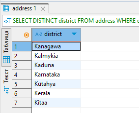
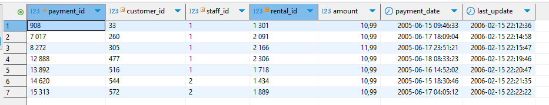
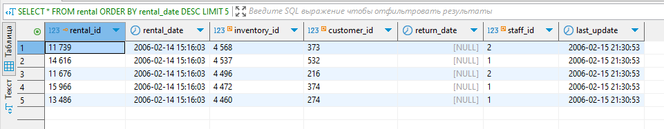

# Домашнее задание к занятию "`SQL. Часть 1`" - `Барышков Михаил`

## Задание 1

Получите уникальные названия районов из таблицы с адресами, которые начинаются на “K” и заканчиваются на “a” и не содержат пробелов.

----

## Решение 1

```sql
SELECT DISTINCT district
FROM address
WHERE district LIKE 'K%a'
  AND district NOT LIKE '% %';
```



----

## Задание 2

Получите из таблицы платежей за прокат фильмов информацию по платежам, которые выполнялись в промежуток с 15 июня 2005 года по 18 июня 2005 года **включительно** и стоимость которых превышает 10.00.

----

## Решение 2

```sql
SELECT *
FROM payment
WHERE payment_date BETWEEN '2005-06-15' AND '2005-06-18 23:59:59'
  AND amount > 10.00;
```



----

## Задание 3

Получите последние пять аренд фильмов.

----

## Решение 3

```sql
SELECT *
FROM rental
ORDER BY rental_date DESC
LIMIT 5;
```



----

## Задание 4

Одним запросом получите активных покупателей, имена которых Kelly или Willie.

Сформируйте вывод в результат таким образом:

- все буквы в фамилии и имени из верхнего регистра переведите в нижний регистр,
- замените буквы 'll' в именах на 'pp'.

----

## Решение 4

```sql
SELECT 
    LOWER(REPLACE(LOWER(first_name), 'll', 'pp')) AS modified_first_name,
    LOWER(last_name) AS modified_last_name
FROM customer
WHERE first_name IN ('Kelly', 'Willie')
  AND active = TRUE;
```


----

## Дополнительные задания (со звёздочкой*)

Эти задания дополнительные, то есть не обязательные к выполнению, и никак не повлияют на получение вами зачёта по этому домашнему заданию. Вы можете их выполнить, если хотите глубже шире разобраться в материале.

## Задание 5*

Выведите Email каждого покупателя, разделив значение Email на две отдельных колонки: в первой колонке должно быть значение, указанное до @, во второй — значение, указанное после @.

## Задание 6*

Доработайте запрос из предыдущего задания, скорректируйте значения в новых колонках: первая буква должна быть заглавной, остальные — строчными.
